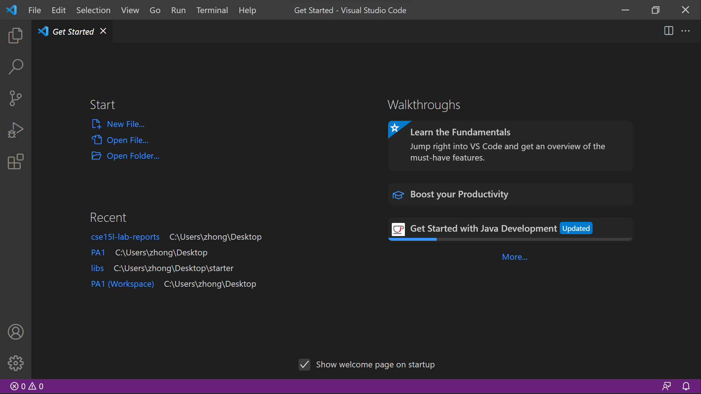
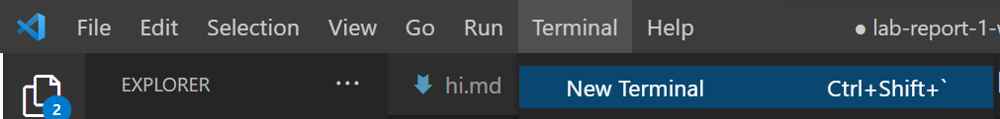
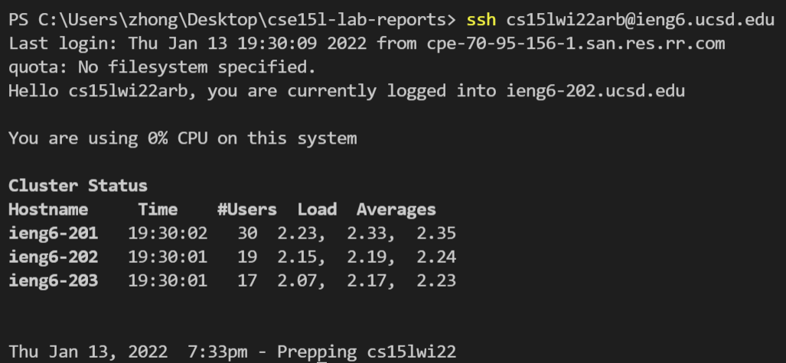
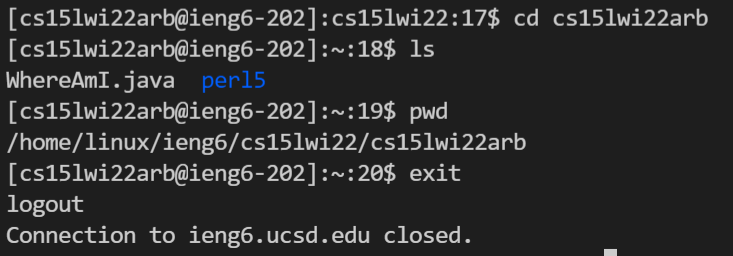
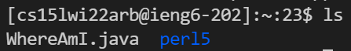
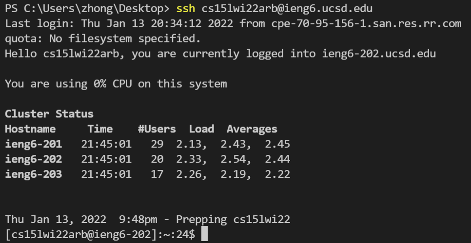
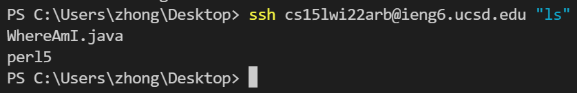
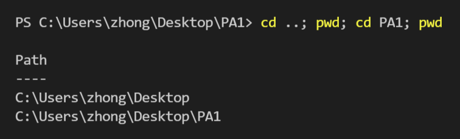

# Week 2 Lab Report

## 1. Installing VSCode (for Windows)
* Go to the [VSCode website](https://code.visualstudio.com/) and follow the download instructions.
* Once download is complete, open VSCode. The screen should look something like this: 

## 2. Remotely Connecting
* Download [OpenSSH](https://docs.microsoft.com/en-us/windows-server/administration/openssh/openssh_install_firstuse)
    * Check if **OpenSSH Client** and **OpenSSH Server** are installed by going to  
        > Settings > Apps > Apps & Features > Optional Features
    * If not, select **Add a feature** and install both.
    * Once installation finishes, they should both show up in **Optional Features**.
* Search for your course-specific account in the [Account Lookup](https://sdacs.ucsd.edu/~icc/index.php)
    * Make sure you [reset the password](https://password.ucsd.edu/).
* Open a new terminal 
* Enter the following command, writing your course-specific account in the blank.
    ```
    $ ssh cs15lwi22______@ieng6.ucsd.edu 
    ```
* You will be asked if you are sure you want to continue connecting. If you log on in the future, you will probably not see it again. Type 'yes' in the terminal, then your password when prompted.
    * Your password will be hidden for confidentiality. This is normal!
* Now, you are connected to the ieng6 server. You should be notified if you logged in successfully with a similar message: 
    * If the terminal keeps prompting you for your password, make sure you entered it correctly.

## 3. Trying Some Commands
* Once you are logged in, you can try some of the commands below:
    * `cd` - change directory
    * `ls` - list files
    * `pwd` - print working directory
    * `mkdir` - make directory
    * `cp` - copy
    * `exit` (or ctrl-d) - log out

    * Here are some sample commands in my terminal: 
               

## 4. Moving Files with `scp`
* `scp` - secure copy protocol
    * A useful command that allows us to copy files from the server (ieng6) to the client (our computer).
    * This command can only be used on the client side (your own computer).
* Try it out by copying the following command into your terminal, replacing the first blank with your file name, and the second blank with your course-specific username.
    ```
    $ scp ______ cs15lwi22______@ieng6.ucsd.edu:~/
    ```
* Now, when you log onto the ieng6 server again, you should see your file listed:  
    * The file I copied was named `WhereAmI.java`.

## 5. Setting an SSH Key
* Typing in a password every time you want to `scp` or login is kind of annoying. We can bypass this step by setting an **SSH Key**.
* By generating a set of keys, one to store on our local computer (private key) and one to store on the server (public key)
* After you set up the keys, the `ssh` command will use the two keys in place of your password.

* Generate the SSH Key: make sure you are on the client!
```
$ ssh-keygen
```
* You will then be prompted to save the private key to your computer. You can just copy the default path in the parentheses. 

* Windows requires an extra step.
    * Open Powershell and run as administrator. Start the service using 
    ```
    $ Start-Service ssh-agent
    ```
    * Make sure your ssh is running 
    ```
    $ Get-Service ssh-agent
    ```
    * Load your key files into ssh-agent, replacing the blank space with the file in the .ssh directory that you saved the private key into.
        * If you used the default path, you would type `id_rsa` in the blank.
    ```
    $ ssh-add ~\.ssh\______
    ```
    * Finally, `scp` your public key into the .ssh directory on ieng6. 
    * As seen below, now we don't need a password to log into the server anymore! 

## 6. Optimizing Remote Running
* You can run server commands from the client by putting the command in quotes after an `ssh` command. 
* Separate commands with semicolons to run multiple at once: 