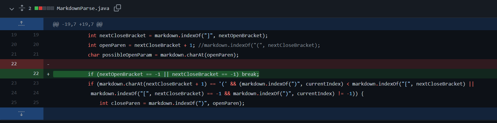
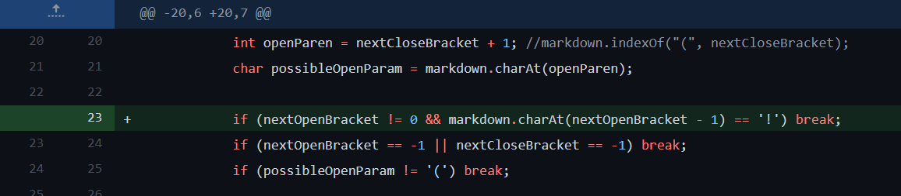
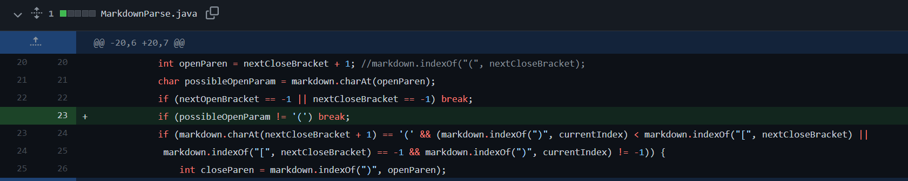

# Week 4 Lab Report

## Code Change 1:



### Link to file: 
[test-issue-1.md](https://github.com/idonotknowwhatiamdoing/markdown-parse/blob/bfe7abee1421bcb19304fc2b560400433a221c66/test-issue-1.md)
```
(link.com)
```

### Symptom: 
```
-1
[link.com]
```

### Summary:
Instead of a properly formatted link with square brackets and parentheses, the failure-inducing input only had a set of parentheses. Because the index for the square bracket ```[``` could not be found, the index returned ```-1```. The output should be a pair of empty brackets because the formatting was incorrect. By checking for the existence of square brackets in the added ```if``` statement, we can fix this issue. 

## Code Change 2: 

### Link to file:
[test-issue-2.md](https://github.com/idonotknowwhatiamdoing/markdown-parse/blob/10a94cca36b8dcf27fdea951968898f0a87eb550/test-issue-2.md)
```
[link](link.com)

```
### Symptom: 
```
[link.com, image link]
```
### Summary: 
When images are included in the test file, MarkdownParse interprets them as links and includes them in the output list of links. The formatting is very similar to that of links, but we don't want them to be included. We can check for the ```!``` in front of the open bracket that tells us the next line is an image, and not include those lines in our output. 

## Code Change 3: 



### Link to file: 
[test-issue-3.md](https://github.com/idonotknowwhatiamdoing/markdown-parse/blob/bfe7abee1421bcb19304fc2b560400433a221c66/test-issue-3.md)
```
[Here is a link] and some text (url.com)
```
### Symptom: 
```
[and some text (url.com]
```
### Summary:
In our original code, we assumed that the formatting would always be correct and that the opening parenthesis ```(``` would always come after the closing bracket ```]```. When this is not true, the link is formatted incorrectly. In our solution, we check to see if the ```char``` directly after ```]``` is ```(```, and if not, we then ```break``` and print a set of empty brackets.