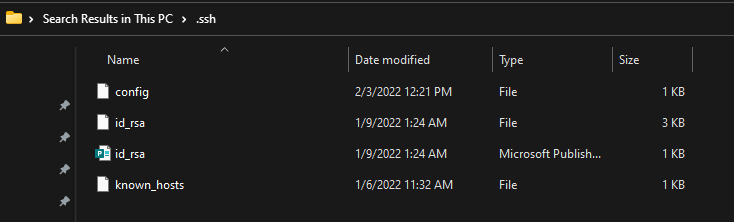

# Week 6 Lab Report

## Streamlining ```ssh``` Configuration
* If you want to log onto ieng6 you have to remember your super long login or copy paste it every time.
* Create (or edit, if the file exists) the ```~/.ssh/config``` file on your computer.

* Edit ```.ssh/config``` file in VSCode.

* After adding in the lines in the image above, try logging onto ieng6 again.
* Use the command ```ssh ieng6```
* You should be able to login with just your alias

* If you want to copy a file, you can use the ```scp``` command.

* The file gets copied without you having to type your super long username.