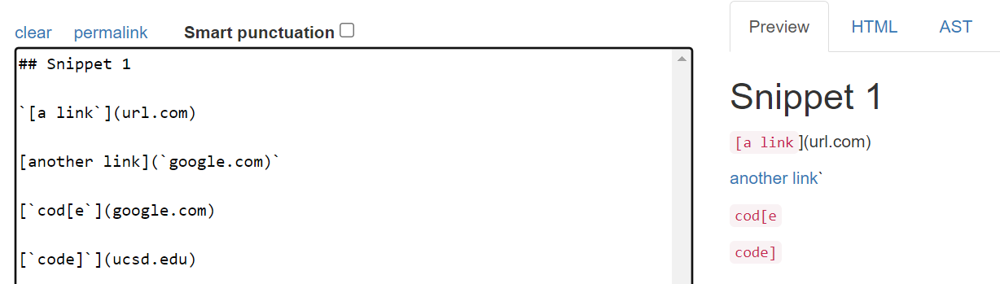
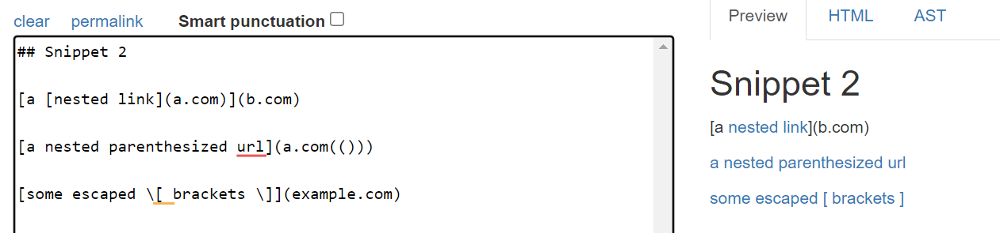
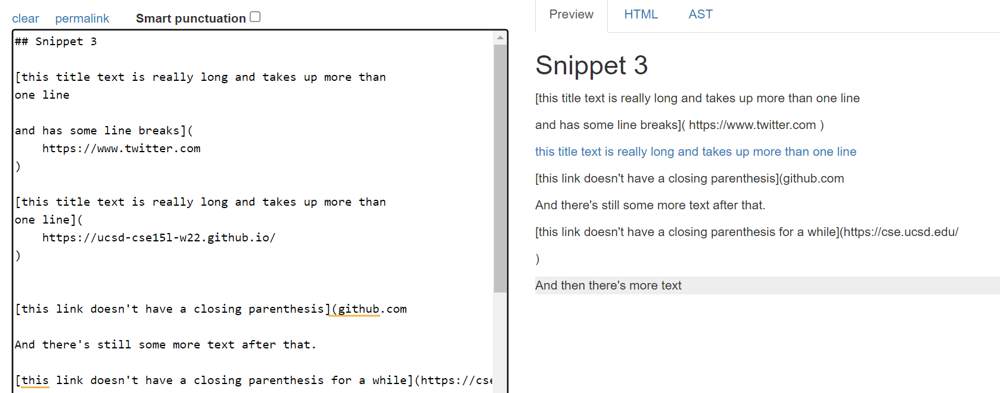
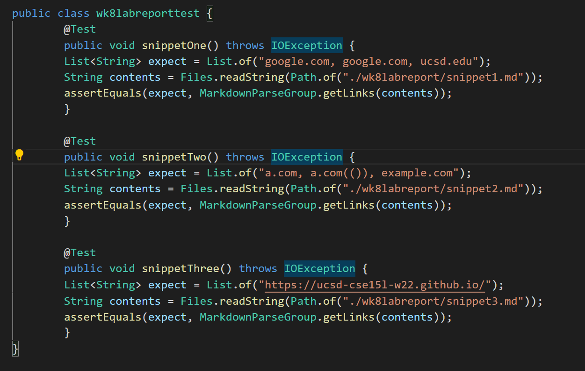
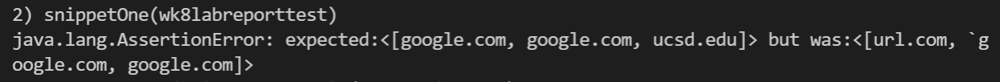
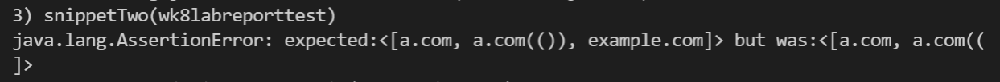
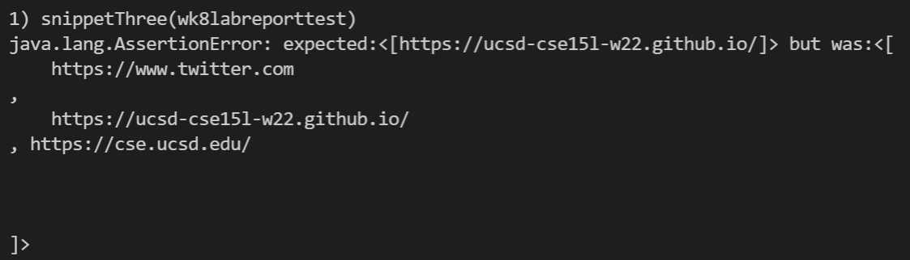
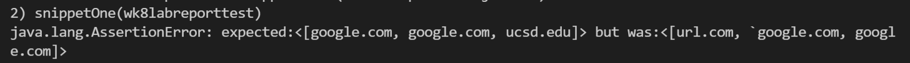
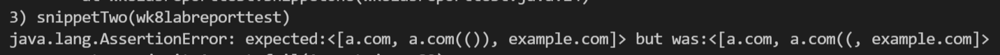
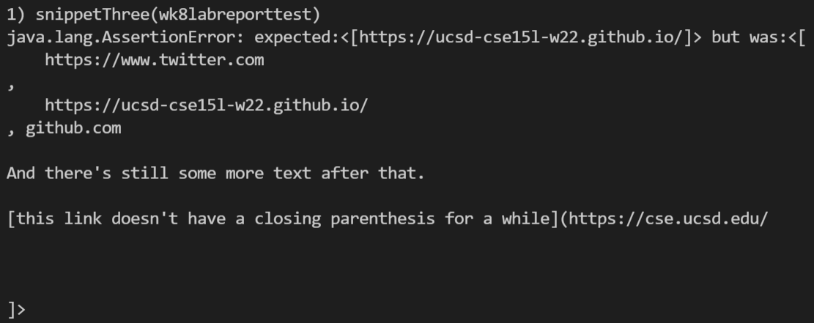

# Week 8 Lab Report
### Snippet 1 Expected Output
```[google.com, google.com, ucsd.edu]```

### Snippet 2 Expected Output
```[a.com, a.com(()), example.com]```

### Snippet 3 Expected Output
```[https://ucsd-cse15l-w22.github.io/]```


Test File:


## My Implementation:
[Link to my MarkdownParse](https://github.com/idonotknowwhatiamdoing/markdown-parse)
### Snippet 1 - Fail

### Snippet 2 - Fail

### Snippet 3 - Fail
   

## Repo I Reviewed:
[Link to repo I reviewed](https://github.com/YueSteveYin/MarkDownParseGroup)
### Snippet 1 - Fail

### Snippet 2 - Fail

### Snippet 3 - Fail
  

## Conclusion
### Snippet 1
To resolve the backticks issue, we could run a loop through the file and search for all the places where the character ``` ` ``` appears. Then, you could use substrings to concatenate the half of the file before and after the backtick to remove it from the file.
### Snippet 2
In CSE12, we talked about implementing stacks to keep track of opening and closing parentheses and brackets. I think we could do something similar, where we use two arrays to store opening and closing parentheses from both ends of each link. In the end, we would use a for loop to see if the parentheses or brackets match each other in pairs.
### Snippet 3
For this problem, the first thing I thought about was that we could probably implement something similar to the fix I described for snippet 1. We would search for ```\n``` within the file, and remove them. However, if we do this, it will be really hard to know where new links start and end. Something else we could do afterwards could be to search for the next ```(``` and ```]``` characters to indicate the beginning and end of a link. The problem with this approach is that it assumes all the links are properly formatted. Thus, I believe to edit MarkdownParse to work with newlines is more complicated than can be fixed in 10 lines.