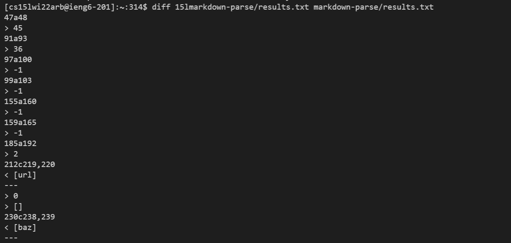
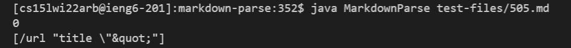
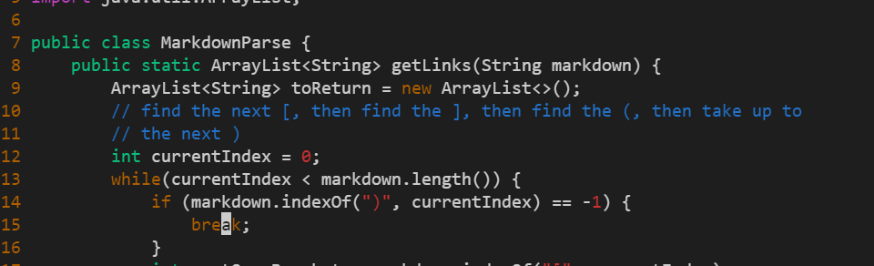
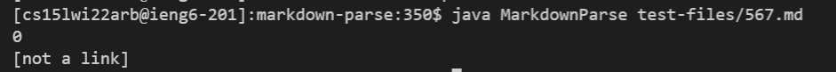
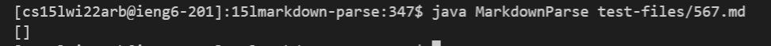
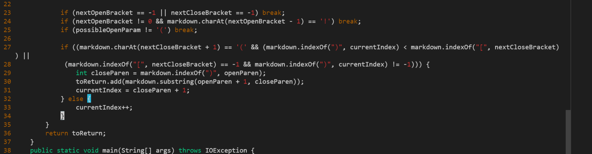

# Week 10 Lab Report

## Finding the bug:
* First I used ```cp``` to copy ```test-files``` and ```script.sh``` into my ```markdown-parse```.
* For both my ```markdown-parse``` as well as the provided, I used 
```
bash script.sh > results.txt
```
to create the ```results.txt``` files needed to do the comparison.

I used ```diff``` on the two files to find discrepancies between the expected and actual outputs.
## Bug 1: ```505.md```
```
[link](/url "title \"&quot;")
```
My output:

Provided implementation output:

Correct output (commonmark): 
```
[url]
```
It seems both implementations were wrong. It seems that forward slashes and back slashes don't count in the expected output. We could go through the file and search for ```/``` and ```\``` characters and remove them from the output string. Since it also seems that text within quotation marks aren't supposed to be included in the final output, we can do something similar for the ```'``` and ```"``` characters. If there is more than 1 single or double quotation mark in the text, we can delete the substring between and including the two quotation marks. Then, we can repeat this for however many more quotation marks exist in the file.

In the while loop on line 13, we can insert ```if``` statement checkers for the slashes and quotation marks so that we check for them along the existing check for end parentheses. Then, we could have a nested loop inside the while loop to initialize a new ```String``` variable and set it to the current file's contents. Then, we could use a for loop to iterate through and find the slash and quotation characters and use ```concat()``` to remove them from the file.
## Bug 2: ```567.md```
```
[foo](not a link)
[foo]: /url1
```
My output:

Provided implementation output:

Correct output (commonmark): 
```
[url1]
```
It seems both implementations were wrong. The same forward and back slash fix from the previous bug could apply to this bug as well. To be honest, I'm not really sure why my implementation did not yield the correct output, because I feel like logically it would. I played around with commonmark and thought that this might be due to the colon in the second line that might be a form of link formatting I did not think of. To fix this issue, we could search for ```:``` character in the file and if its index is not ```-1```, then read everything after it as the link.

We could insert the check for the colon character after the final checks for a valid input on line 26. Using a similar method as the first fix, we could use an ```if``` statement to check for the ```:``` character and if it exists, to use ```concat()``` to read everything that comes after the colon as a link.