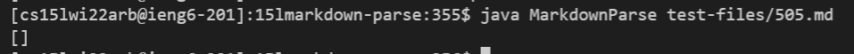

# Week 10 Lab Report

## Finding the bug:
* First I used ```cp``` to copy ```test-files``` and ```script.sh``` into my ```markdown-parse```.
* For both my ```markdown-parse``` as well as the provided, I used 
```
bash script.sh > results.txt
```
to create the ```results.txt``` files needed to do the comparison.

I used ```diff``` on the two files to find discrepancies between the expected and actual outputs.
## Bug 1: ```505.md```
My output:

Provided output:

Correct output (commonmark): 
```
[url]
```
## Bug 2: ```567.md```
My output:

Provided output:

Correct output (commonmark): 
```
[url1]
```